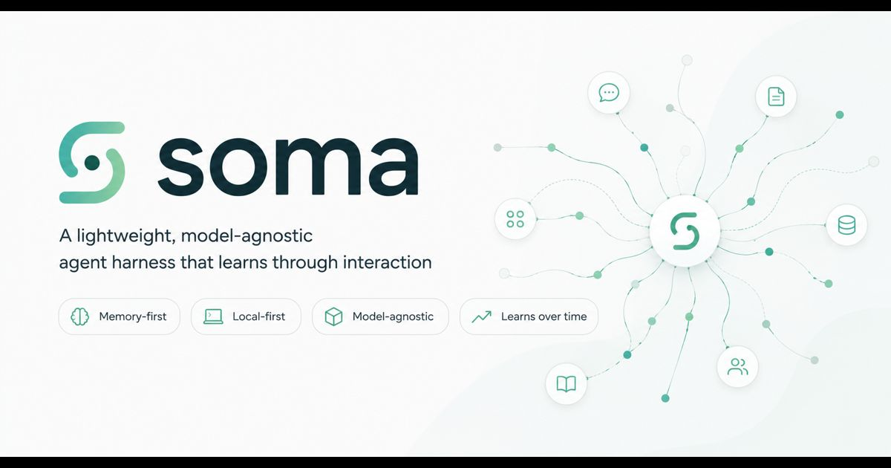

<p align="center">
  
</p>

# Soma

```bash
git clone https://github.com/HeNryous/soma.git && cd soma && ./install.sh
$EDITOR .env        # paste your Telegram token + chat-id + LLM endpoint
./start_soma.sh
```

A lightweight, model-agnostic agent harness that learns through interaction.

Soma is the cell body of a neuron — the integrator where inputs from many
dendrites become a single decision. The same role this harness plays: it
holds the loop, the memory, the body, and the slow learning around a fast,
ephemeral language model.

Single-user by design. Local-first. Runs on consumer hardware.
**~3400 lines of Python, three dependencies, no framework.**

---

## What Soma does

Soma is the harness around an LLM that turns it into a personal agent. It
talks via Telegram, executes code in a sandboxed Docker container, and
**remembers everything that matters across sessions** — facts, preferences,
procedures, and the mistakes it has already learned not to repeat.

Day-1 the agent answers questions and creates files. Week-2 the same agent
knows your domain, your customers, your style preferences, and a handful of
crystallized procedures it has extracted from its own past behavior.

The bet behind Soma:

> **Architecture beats prompt-engineering when reasoning models hallucinate
> tool-calls.** Reliability comes from how the harness is built, not from
> bigger weights or sharper prompts.

---

## Core features

### 1. Programmatic Tool Calling (PTC)
The model writes Markdown code-blocks (` ```shell ` / ` ```python `). The
harness extracts them with a regex and executes them in the sandbox. The
result is appended as a `role="user"` message. Loop until the model answers
in plain text. **No OpenAI tool-call format. No model-specific parser.**
Any model that can write fenced code-blocks works.

### 2. Three-type memory, first-class
- **Semantic** — facts the user told us, or the bot learned (`User prefers metric units`)
- **Procedural** — reusable how-to procedures (`PROCEDURE: shell:echo …`)
- **Episodic** — past events worth keeping (turn pairs auto-replayed)

Memories are persisted JSONL. The model **writes via shell-echo**, the harness
**reads in Python**. Style-tagged memories (`preference`, `style`, `tone`,
`behavior`) are rendered as a `Behavior Rules`-block at the top of the
prompt.

**Immortal vs. mortal tags.** Memories tagged `preference`, `style`, `tone`,
`behavior`, `domain`, `role`, or `identity` are immortal — `score()` returns
`+inf` so they survive every prune. These are the system's base knowledge
(domain definitions, the user's role, persistent style preferences). Everything
else — `episodic`, `research`, `discovered`, `from-file`, `error-lesson`,
`crystallized` — uses the regular `recency × frequency × type-weight` decay
and gets pruned when stale.

**Curator-driven context selection.** When more than 15 memories exist,
the background curator picks 5-8 of them as **most relevant for this
specific turn** (one extra vLLM call, ~200-400 input tokens, ~50 output).
The IDs are written to `data/workspace/context_selection.json`. The
foreground then renders the prompt in three blocks:

1. **Behavior Rules** — style/behavior memories (always)
2. **Relevant context** — the 5-8 selected by the curator
3. **Further memories** — tag-matched memories whose tags appear in
   the current user query, excluding already-selected ones

Below the 15-memory threshold or when no selection file exists: fallback
to the simpler group-by-type rendering.

### 3. Background curator (async task)
A second async task runs next to the Telegram polling. It is **event-driven,
not poll-driven** — fed via `asyncio.Queue` after each foreground turn, and
falling back to an idle-tick after 90s of silence. The curator:

- Writes memories the foreground forgot
- Extracts lessons from failed `code_executed` events
- **Picks the 5-8 most relevant memory IDs for the next turn** and writes
  them to `context_selection.json` so the foreground can render them as a
  prominent `Relevant context`-block
- Adjusts inner states (curiosity, boredom, confidence) based on usage stats
- Runs sleep-consolidation in idle phases (fuse + prune + REM-style synthesis)
- Picks ONE knowledge-hole and researches it on the web when curiosity > 0.65
  (via `requests` + `beautifulsoup4` inside the sandbox)
- Browses the web freely when boredom AND curiosity are both high, using
  recent memories as starting points; rate-limited to 3 requests per
  idle-tick and 10 per hour. Findings get tag `discovered`; irrelevant
  results are forgotten, not stored
- Can proactively message the user (rate-limited 3 per 24h) via
  `notify_user.txt`

File-handling is **not** in the background's hands — every uploaded file
is processed by the foreground immediately (see point 10 below).

### 4. Skill crystallization
After 3+ executions of the same code pattern (`lang:firsttoken`), the harness
writes a procedural memory with a concrete example. Idempotent through tag-set
matching. Triggered automatically every 20 `code_executed` events.

### 5. Sleep consolidation (NREM + REM)
During idle phases:
- **NREM** — fuse near-duplicates, prune below score-threshold
- **REM** — sample 5 random memories, ask the model whether there's a
  synthesis worth keeping with tag `synthesis`

### 6. Forgetting (P4)
Score function `recency × (1 + log frequency) × type_weight`. Auto-prune at
200 memories, keep 100 + all style-tagged (immortal). Plus token-overlap
fusion of near-duplicates.

### 7. Closed-loop correction
- `detect_correction` recognizes negation / contradiction keywords ("no",
  "wrong", "shorter", "different", and similar — list is configurable
  in `events.py:CORRECTION_PATTERNS`)
- `build_broken_promise_note` catches the model lying ("noted" without
  an actual memory write) and the next turn deterministically
  auto-captures the previous user message
- Memory-conflict detection: ≥2 shared tags + same type → logged + reminder
  injected next turn

### 8. Context compression (Head-Middle-Tail)
At >40 messages or >200K chars: head (first 5) + tail (last 10) kept intact,
middle compressed into a `Resolved / Pending / Decisions / Results` summary by
a single model call. Cooldown 10 iterations.

### 9. Append-only event log
Everything that happens lives in `events.jsonl`:
`prompt_received, model_call, code_executed, response_sent, correction,
memory_pruned, memory_fused, auto_crystallized, memory_conflict_detected,
memory_promise_unfulfilled, context_selection_written, background_curated,
background_error_lesson, background_self_monitor, background_consolidation,
background_reflection, background_notification, background_research,
background_browse, compression_applied`. The full state can be
reconstructed from this log.

### 10. Message + file handling (debouncing, serialization, batch-summary)
Telegram-handler buffers messages within a 3 s window into one turn. A
`core_lock` ensures only one `core.run()` is in flight at a time so that
fast follow-up messages don't race or contaminate each other's context.

Files arrive on the same buffer:

- **One file, no caption** → immediate `core.run` with an auto-investigate
  prompt: open via `execute`, extract, persist any substantial facts as
  memory with tag `from-file`, return a one-line classification. The bot
  then asks *"What should I do with this?"* — no silent placement.
- **One file with caption** → the caption *is* the task, file path is
  context.
- **Multiple files in the 3-second window** → all are processed
  sequentially (still under `core_lock`, no parallel runs, no spam per
  file). After the batch finishes, **one** Telegram message lists the
  per-file classifications and asks what to do with them. Information
  worth keeping is already in memory.
- **Binary formats** (`.msg .pdf .xlsx .docx .png …`) → the prompt
  explicitly instructs the model to extract in-container with
  `pypdf`/`extract_msg`/`openpyxl` and only return a summary — never
  load the whole file into the LLM context.

---

## Architecture

```
Telegram-Bot (aiogram)
  │
  ├── Foreground: core.run()        — chats, executes (PTC)
  │     └── _post_run_maintenance   — fusion, crystallization, conflict-detect
  │
  └── Background: async curator     — observes, learns, notices, sleeps
        ├── reads event-log → writes missing memories
        ├── detects corrections     → immediate semantic memory
        ├── detects failed execs    → procedural error-lesson
        ├── tracks inner states     (curiosity / boredom / confidence)
        ├── inbox-watch             — notes unprocessed files
        ├── proactive notification  → notify_user.txt → bot.send_message
        ├── sleep-consolidation     — NREM fuse+prune, REM synthesis
        └── self-monitoring + reflection
```

Both share the event-log, the memory store, and the same sandboxed container.
Both use PTC.

---

## Hardware

Soma is built and tested on a small two-node GPU setup running an
AWQ-quantized 100B-class reasoning model served by vLLM with tensor-parallel=2,
but **nothing in the harness is hardware-specific**. The model endpoint is
OpenAI-compatible HTTP.

Minimum reasonable setup:
- A box running an OpenAI-compatible inference server (vLLM, llama.cpp, Ollama, …)
- Docker for the sandbox container
- Python 3.10+ on the host (3 deps installed automatically: `aiogram`, `httpx`, `pyyaml`)
- Telegram bot token (single-user)

Model size: works with anything that follows Markdown code-block conventions
and has a context window ≥ 32k tokens. Tested heavily on MiniMax-M2.7;
should work with similarly-sized reasoning models.

### Network isolation

The sandbox container runs with `--network=bridge` so the model can `pip
install` and reach the open web. Soma's deploy script adds an iptables
`DOCKER-USER` rule to drop traffic from the container to any private
`<YOUR_PRIVATE_CIDR>` host — protecting the inference cluster and any other
internal services on that subnet from the sandbox. Adjust the rule (or
swap it for an `INTERNAL` Docker network) if your private range is
different.

### systemd

A `soma.service` unit ships in the repo (see `Quick start`). Logs go to
journald — `journalctl -u soma -f` for live, `journalctl -u soma --since 1h`
for retro.

---

## Quick start

```bash
git clone https://github.com/<your-account>/soma.git
cd soma
./install.sh        # check prereqs, create venv, install deps, build sandbox, run tests
$EDITOR .env        # paste your Telegram token + numeric chat-id
./start_soma.sh     # run the bot
```

That's it. `install.sh` is idempotent — safe to re-run after a pull.

To pull updates later: `./update.sh` (auto-rolls back if tests fail or the
service won't restart). `./update.sh --yes` skips prompts for cron.

What `install.sh` does:

1. Checks `python3 >= 3.10`, `docker`, `pip`
2. Creates a `.venv/` next to the repo and installs the 3 host deps
   (`aiogram`, `httpx`, `pyyaml`) — no system pollution, plays nicely with PEP 668
3. Creates the `data/` tree (`workspace/`, `inbox/`, `sandbox-home/`)
4. Pulls `python:3.12-slim` and creates a `soma-sandbox` container with
   the right bind-mounts
5. Copies `.env.example` to `.env` if missing
6. Runs the 8-suite test pack and reports green/red

What you still provide:

- An OpenAI-compatible LLM endpoint (vLLM, llama.cpp server, hosted API)
- A Telegram bot token (via `@BotFather`) and your numeric chat-id

Once `.env` is filled in, talk to your bot in Telegram. Send "create test.txt
with Hello". The file appears in `data/sandbox/workspace/test.txt`. That's
the loop.

For CLI smoke-tests without Telegram: `.venv/bin/python3 src/core.py "your message"`.

For state at a glance: `.venv/bin/python3 src/status.py`.

All runtime state (memories, events, inner state, inbox uploads, pip-installed
packages inside the sandbox) lives under `data/` and is gitignored — the repo
checkout itself only ever contains code.

### Manual install

If you prefer not to use the installer:

```bash
python3 -m venv .venv
.venv/bin/pip install -r requirements.txt
mkdir -p data/sandbox-home data/sandbox/workspace data/sandbox/inbox
docker run -d --name soma-sandbox --network bridge --restart unless-stopped \
  -v "$PWD/data/sandbox-home:/root" \
  -v "$PWD/data/sandbox/workspace:/workspace" \
  -v "$PWD/data/sandbox/inbox:/inbox" \
  -w /workspace python:3.12-slim sleep infinity
cp .env.example .env && $EDITOR .env
./start_soma.sh
```

### Optional: systemd service

For autostart on boot:

```bash
sudo cp soma.service /etc/systemd/system/
# edit paths/user in the unit file if your layout differs
sudo systemctl daemon-reload
sudo systemctl enable --now soma.service
journalctl -u soma -f
```

### Optional: isolate the sandbox from your private network

If your inference server or other internal services live on a private
subnet you don't want the model to reach, add a host-level iptables rule:

```bash
# Adapt <YOUR_PRIVATE_CIDR> to your private CIDR
sudo iptables -I DOCKER-USER 1 -d <YOUR_PRIVATE_CIDR> -j DROP \
  -m comment --comment "soma: block container→private-net"
sudo iptables -I DOCKER-USER 2 -s <YOUR_PRIVATE_CIDR> -j DROP \
  -m comment --comment "soma: block private-net→container"
```

The sandbox still reaches the public internet (`pip install`, web fetch
for the curiosity/browse actions), but private hosts on that subnet are
unreachable.

---

## Research that informed the design

Soma is small, but it stands on a few ideas that have been validated
elsewhere. Names + one-liners; follow the breadcrumbs for the papers.

- **Reasoning Trap** (ICLR 2026) — reasoning models hallucinate tool-calls.
  Better prompts trade reliability for capability. The only escape is
  architectural. PTC + broken-promise-detection are Soma's answer.

- **Hermes Agent** (Nous Research) — PTC (`execute_code`) lets the model
  write a script instead of stringing tool-calls. The harness only sees the
  final `print()`. Soma adopts this directly.

- **Hermes Head-Middle-Tail compression** — protect the first/last, summarize
  the middle. Soma's `compress_middle()` is a small re-implementation.

- **Hermes Skills** — after N similar tool-calls, crystallise a reusable
  procedure. Soma's `crystallize.py` is this idea on a small scale.

- **Anthropic Brain/Hands decoupling** (April 2026) — keep session, harness,
  and sandbox as separate stateless concerns with their own lifecycles. Soma's
  `core.run()` / container / event-log mirror this split.

- **Session-Governor-Executor pattern** (Zylos Research) — agents must
  architect for episodic, semantic, and procedural memory as first-class
  citizens. Soma's three memory types do exactly this.

- **SCM: Sleep-Consolidated Memory** (April 2026) — NREM strengthens
  important memories, REM creates new associations, algorithmic forgetting
  beats time-based decay. Soma's background does this in idle phases.

- **FadeMem** (Jan 2026) — adaptive exponential decay + LLM-guided conflict
  resolution + memory fusion. Soma's `score()` + `fuse()` are simpler but
  in the same spirit.

- **Forge: Agentic Reliability Guardrails** (2026) — guardrails (retry,
  step-enforcement, context-compaction, error-recovery) beat bigger models.
  Soma's broken-promise-detection, auto-capture, and conflict-detect are
  exactly that flavour.

- **Bitter Lesson for harnesses** (Phil Schmid) — every new model release has
  a different optimal way to structure agents, so the harness must stay
  lightweight enough to throw away. Soma is built to be rewritten.

---

## File layout

```
soma/
├── src/
│   ├── core.py        — PTC loop, compression, conflict-detect, classifiers
│   ├── memory.py      — JSONL store + fuse + prune + score + tag-conflict
│   ├── events.py      — append-only log + correction + broken-promise renderers
│   ├── background.py  — async curator: queue + idle-tick + sleep + browse + notify
│   ├── crystallize.py — skill crystallization from event-log code patterns
│   ├── self_model.py  — derive(), summarize(), describe() — what the system knows
│   ├── state.py       — inner states (curiosity / boredom / confidence)
│   ├── telegram.py    — aiogram bot + debounce + serialize + file-handler
│   ├── status.py      — human-readable CLI dashboard
│   └── envfile.py     — minimal .env parser (no python-dotenv)
├── tests/             — eight unit-test files, ~60 tests, all green
├── docs/
│   └── banner.jpg     — README header image
├── install.sh         — one-shot installer: prereq-check, venv, deps, sandbox, tests
├── update.sh          — pull + re-install + restart, with auto-rollback on failure
├── start_soma.sh      — convenience launcher (uses .venv/ if present)
├── soma.service       — example systemd unit (cp to /etc/systemd/system/)
├── requirements.txt   — three host-side Python deps
├── .env.example       — copy + paste your token
└── data/              — gitignored, holds all runtime state
    ├── workspace/     — bind-mounted into the container
    ├── events.jsonl   — append-only audit log
    └── sandbox-home/  — pip --user installs from inside the sandbox
```

---

## Status

As of `2026-05-12`: 15/17 brief tests green, 2 yellow (1-week-better needs
time, proactive-live-trigger needs an organic occasion), 0 red. ~4100 LOC
across nine modules, no Python framework, three external dependencies.

About 55 unit tests across eight test files. Live-tested against a real
Telegram bot and a vLLM-served reasoning model: PTC loop, three-type
memory with immortal/mortal tag split, curator-driven context selection,
debouncing + serialization, broken-promise auto-capture, post-write
conflict detection, head-middle-tail compression, sequential file-batch
handling with one summary message, async background curator with idle-tick,
sleep consolidation, curiosity-driven research, and bored-browse with
rate-limits — all confirmed working end-to-end.

Single-user by design. Multi-user would require routing memory + events per
chat-id and is out of scope.

---

## License

MIT — see [LICENSE](LICENSE).

---

## Origin

This codebase was written by **Claude Code** (Anthropic's coding agent) in a
single multi-hour pair-programming session. A human collaborator set the
goals, ran the live tests against a real Telegram bot and vLLM cluster,
spotted the regressions, and corrected course; the model did the typing,
ran the tests, and proposed the architecture turn-by-turn.

Most of the interesting design decisions emerged from things that didn't
work: prompt-only fixes for tool-call hallucination kept failing, which is
why PTC + broken-promise-detection + auto-capture exist as architectural
guardrails. The third-person-speech bug led to the message-debouncing +
serialization lock. The "ich merke mir das" lie led to the deterministic
auto-capture path. None of these were planned upfront — they were
debugged into existence during the same session.

The point of saying this openly: Soma is what a single live session of
agentic coding can produce when the human stays in the loop. Take the
ideas, take the code, rewrite both — that's the spirit of the
"Bitter Lesson for harnesses" reference above.
